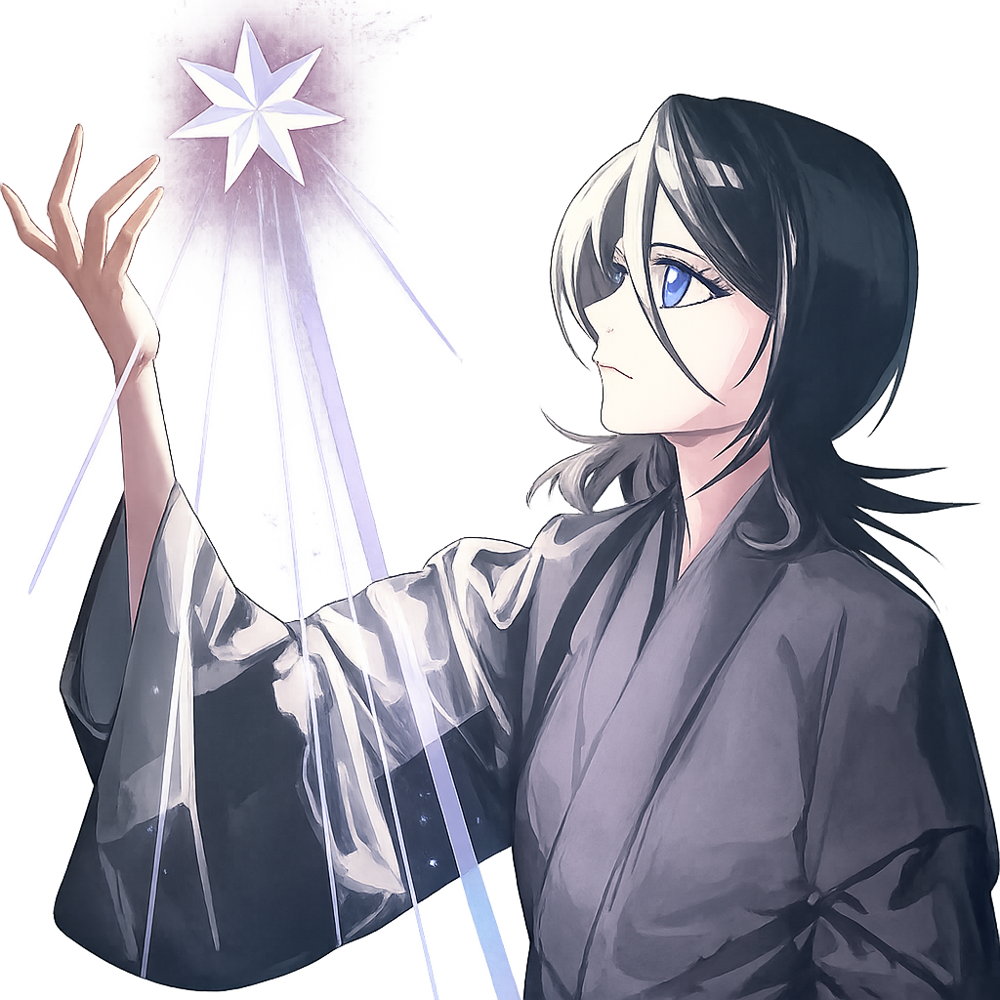

## How are you ? 👋

I am learning Computer Science recently. Don't have much projects yet, but I am willing to share what I have learned. 

Feel free to reach out to me if you have any questions or just want to say hi!

Thanks if you could give me a star ⭐️ on my repositories!

[🌐 Visit my website](https://blankke.github.io/) | 📧 Email: 1174557570@qq.com

---

<picture>
  <source media="(prefers-color-scheme: dark)" srcset="https://raw.githubusercontent.com/Blankke/Blankke/output/github-contribution-grid-snake-dark.svg">
  <source media="(prefers-color-scheme: light)" srcset="https://raw.githubusercontent.com/Blankke/Blankke/output/github-contribution-grid-snake.svg">
  
</picture>

<table>
  <tr>
    <td>
      <a href="https://github.com/anuraghazra/github-readme-stats">
        <picture>
          <source media="(prefers-color-scheme: dark)" srcset="https://github-vercel-deployment-sigma.vercel.app/api?username=Blankke&show_icons=true&theme=vue-dark&count_private=true&include_all_commits=true&hide_border=true&v=2">
          <source media="(prefers-color-scheme: light)" srcset="https://github-vercel-deployment-sigma.vercel.app/api?username=Blankke&show_icons=true&theme=vue&count_private=true&include_all_commits=true&hide_border=true&v=2">
          
        </picture>
      </a>
    </td>
    <td>
      <a href="https://github.com/anuraghazra/github-readme-stats">
        <picture>
          <source media="(prefers-color-scheme: dark)" srcset="https://github-vercel-deployment-sigma.vercel.app/api/top-langs/?username=Blankke&layout=compact&theme=vue-dark&hide_border=true&v=2">
          <source media="(prefers-color-scheme: light)" srcset="https://github-vercel-deployment-sigma.vercel.app/api/top-langs/?username=Blankke&layout=compact&theme=vue&hide_border=true&v=2">
          
        </picture>
      </a>
    </td>
  </tr>
</table>

<a href="https://github.com/anuraghazra/github-readme-stats">
  <picture>
    <source media="(prefers-color-scheme: dark)" srcset="https://github-vercel-deployment-sigma.vercel.app/api/wakatime?username=blankke&theme=vue-dark&layout=compact&hide_border=true&range=last_7_days&v=2">
    <source media="(prefers-color-scheme: light)" srcset="https://github-vercel-deployment-sigma.vercel.app/api/wakatime?username=blankke&theme=vue&layout=compact&hide_border=true&range=last_7_days&v=2">
    
  </picture>
</a>

*****

  

*****

